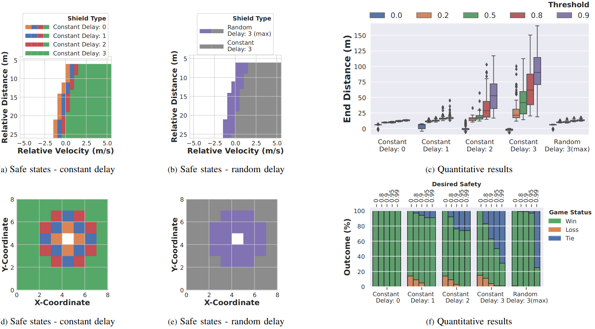

# safe_networked_robotics
The is the repo of **S**afe **N**etworked **R**obotics **v**ia **F**ormal **V**erification. 

Link to paper: [Safe Networked Robotics via Formal Verification](https://arxiv.org/abs/2302.09182)


## TLDR
This paper develops methods to ensure the safety of teleoperated robots with stochastic latency. To do so, we use tools from formal verification to construct a shield (i.e.,run-time monitor) that provides a list of safe actions for any delayed sensory observation, given the expected and worst-case network latency.

## Abstract
<details>
<summary>Click to expand</summary>
Autonomous robots must utilize rich sensory data to make safe control decisions. To process this data, compute-constrained robots often require assistance from remote computation, or the cloud, that runs compute-intensive deep neural network perception or control models. However, this assistance comes at the cost of a time delay due to network latency, resulting in past observations being used in the cloud to compute the control commands for the present robot state. Such communication delays could potentially lead to the violation of essential safety properties, such as collision avoidance. This paper develops methods to ensure the safety of robots operated over communication networks with stochastic latency. To do so, we use tools from formal verification to construct a shield, i.e., a run-time monitor, that provides a list of safe actions for any delayed sensory observation, given the expected and maximum network latency. Our shield is minimally intrusive and enables networked robots to satisfy key safety constraints, expressed as temporal logic specifications, with desired probability. We demonstrate our approach on a real F1/10th autonomous vehicle that navigates in indoor environments and transmits rich LiDAR sensory data over congested WiFi links.
</details>

## Results

**Top:** Qualitative and Quantitative results that highlight the safety efficiency trade-off for our car following environment  
**Bottom:** Qualitative and Quantitative results that highlight the safety efficiency trade-off for our grid-world environment  


## Usage

### Repicate our results for the car following experiments

Check the [ReadMe for car following](cruise_control_env/README.md)

### Repicate our results for the grid world experiments

Check the [ReadMe for grid world](grid_world_env/README.md)

## Citation
If you find this repo useful, please cite our paper:
```
@article{narasimhan2023safe,
  title={Safe Networked Robotics via Formal Verification},
  author={Narasimhan, Sai Shankar and Bhat, Sharachchandra and Chinchali, Sandeep P},
  journal={arXiv preprint arXiv:2302.09182},
  year={2023}
}
```
