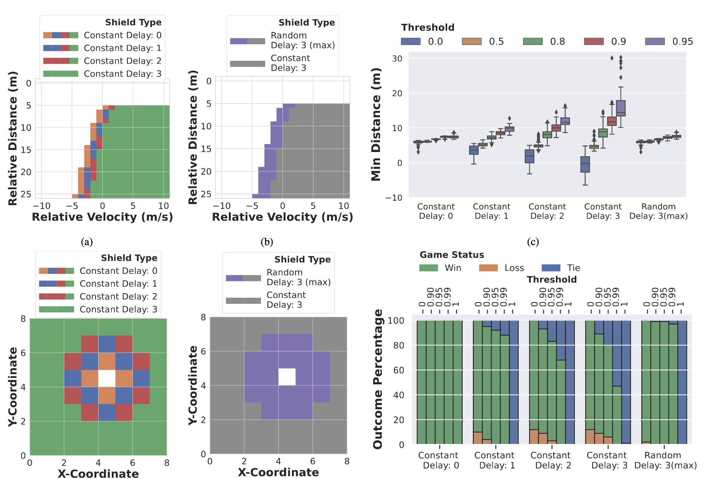

# safe_networked_robotics
The is the repo of **S**afe **N**etworked **R**obotics **v**ia **F**ormal **V**erification. 

Link to paper: [Safe Networked Robotics via Formal Verification](https://arxiv.org/abs/2302.09182)


## TLDR
This paper develops methods to ensure the safety of teleoperated robots with stochastic latency. To do so, we use tools from formal verification to construct a shield (i.e.,run-time monitor) that provides a list of safe actions for any delayed sensory observation, given the expected and worst-case network latency.

## Abstract
<details>
<summary>Click to expand</summary>
Autonomous robots must utilize rich sensory data to make safe control decisions. Often, compute-constrained robots require assistance from remote computation (“the cloud”) if they need to invoke compute-intensive Deep Neural Network perception or control models. Likewise, a robot can be remotely teleoperated by a human during risky scenarios. However, this assistance comes at the cost of a time delay due to network latency, resulting in stale/delayed observations being used in the cloud to compute the control commands for the present
robot state. Such communication delays could potentially lead to the violation of essential safety properties, such as collision
avoidance. This paper develops methods to ensure the safety of teleoperated robots with stochastic latency. To do so, we use tools from formal verification to construct a shield (i.e., run-time monitor) that provides a list of safe actions for any delayed sensory observation, given the expected and worst-case network latency. Our shield is minimally intrusive and enables networked robots to satisfy key safety constraints, expressed as temporal logic specifications, with high probability. Our approach gracefully improves a teleoperated robot’s safety vs. efficiency trade-off as a function of network latency, allowing us to quantify performance gains for WiFi or even future 5G networks. We demonstrate our approach on a real F1/10th autonomous vehicle that navigates in crowded indoor environments and transmits rich LiDAR sensory data over congested WiFi links.
</details>

## Results

**Top:** Qualitative and Quantitative results that highlight the safety efficiency trade-off for our car following environment  
**Bottom:** Qualitative and Quantitative results that highlight the safety efficiency trade-off for our grid-world environment  


## Usage

### Repicate our results for car following
## To generate mdp without delay 
```
python safe_networked_robotics/cruise_control/no_td_mdp.py
```
## To generate mdp with constant delay 
```
python safe_networked_robotics/cruise_control/constant_td_mdp.py time_delay
```
## To generate mdp with random delay
```
python safe_networked_robotics/cruise_control/cruise_control.py
```
## To generate the plot 
```
python safe_networked_robotics/cruise_control_eval/thres_test.py
```

## Citation
If you find this repo useful, please cite our paper:
```
@article{narasimhan2023safe,
  title={Safe Networked Robotics via Formal Verification},
  author={Narasimhan, Sai Shankar and Bhat, Sharachchandra and Chinchali, Sandeep P},
  journal={arXiv preprint arXiv:2302.09182},
  year={2023}
}
```
